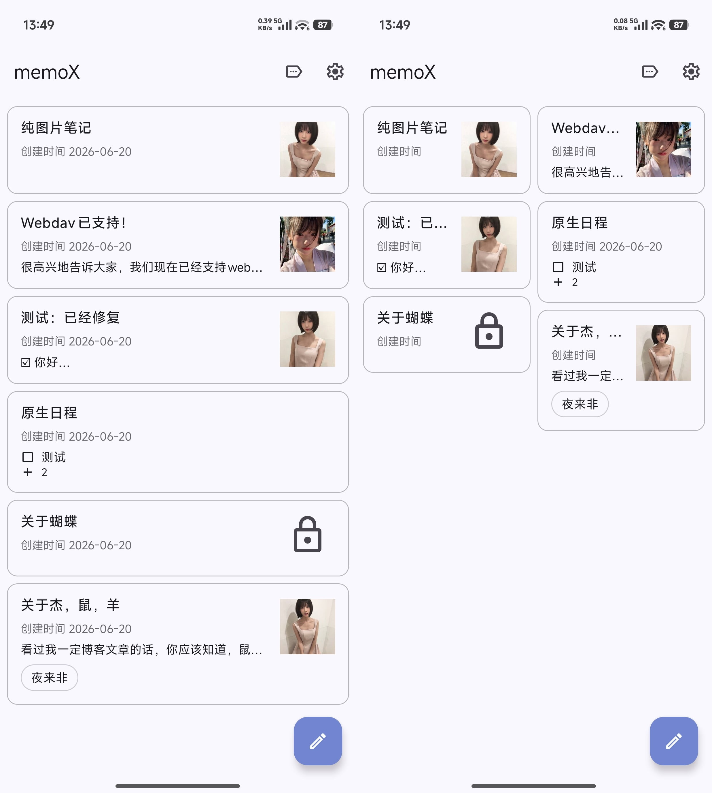
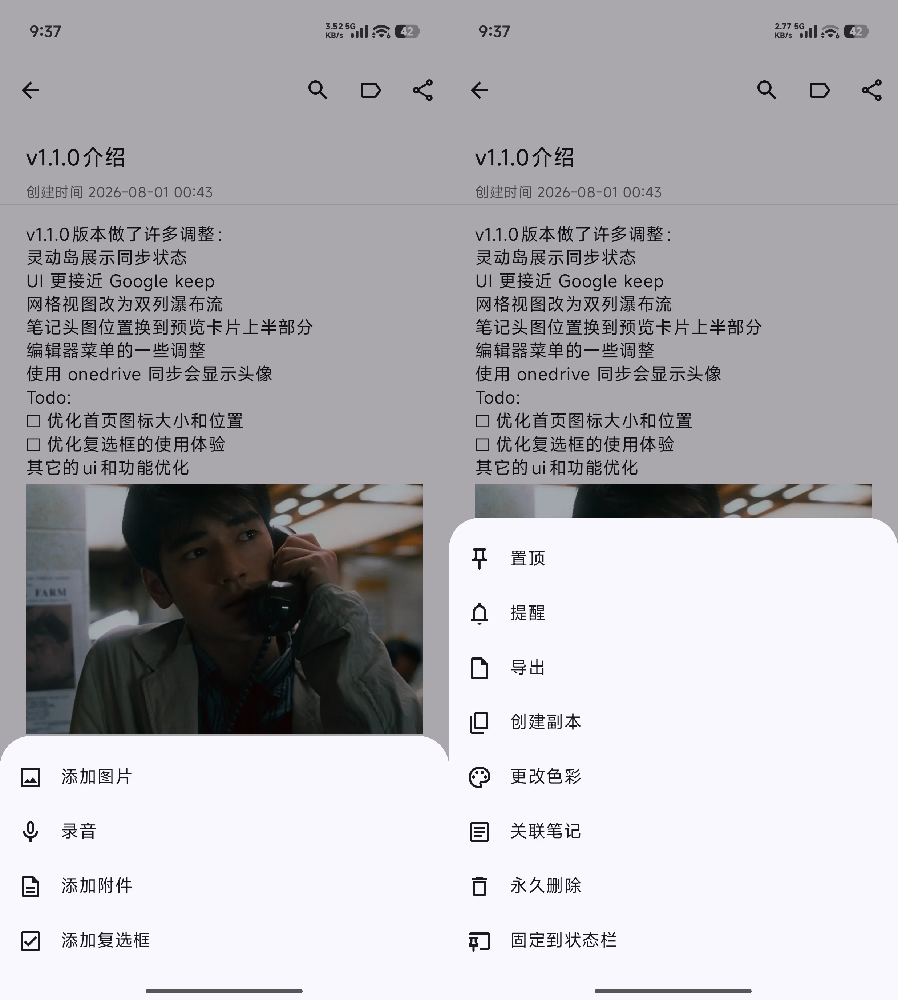
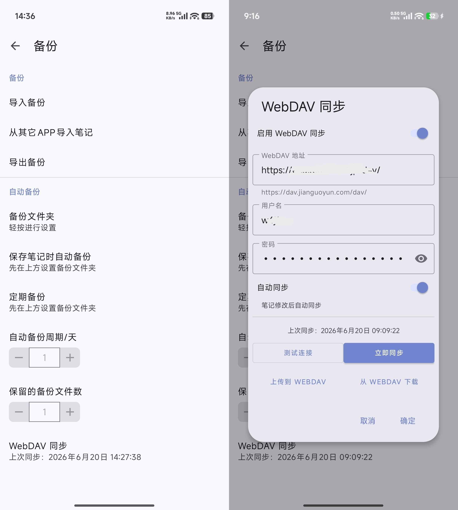

# memoX

一款简约的 Android 笔记应用。

Fork 自 [NotallyX](https://github.com/PhilKas/NotallyX)，进行了大量 UI 重构和功能重塑。

## 安全

绝对不收集用户的个人信息，没有额外的任何广告，联网权限用于 WebDAV 同步。

*目前已知：*

*1.有短、彩信权限，但本应用和引入的库均为发现相关权限要求，猜测可能是分享功能所需。*

*2.锁定的笔记需要通过生物识别或 PIN 码解锁查看，实际未混淆加密笔记，同步到 WebDAV 时也没有加密，后续改进。*

## 功能特性

- **笔记与清单** — 创建文本笔记，支持内联可交互复选框，支持富文本
- **图片与附件** — 在笔记中插入图片、录音和文件附件
- **标签** — 使用标签分类管理笔记
- **提醒** — 为笔记设置提醒
- **搜索** — 可展开的搜索栏，支持关键词过滤
- **WebDAV 同步** — 通过 WebDAV 服务器双向同步笔记和附件
  - 笔记修改后自动上传
  - 启动应用时自动拉取远端更新
  - 每 5 分钟定时双向同步
  - 支持手动上传/下载
  - 标签的显示/隐藏状态随同步在设备间保持一致（采用三方合并，取消隐藏也会传播）
- **灵动岛同步状态指示** — 顶部工具栏中以"灵动岛"药丸样式实时显示同步状态：同步中显示旋转图标，同步完成显示完成图标，并以展开/收缩动画平滑出现与消失
- **自动备份** — 可设置定时自动备份到本地存储
- **导入/导出** — 支持 JSON、HTML、纯文本和 Evernote 格式
- **生物识别锁** — 使用指纹或系统锁屏 PIN 保护笔记
- **动态配色** — Android 12+ 支持 Material You 主题

## 截图







## TODO

1.一些细小的使用体验优化，并加强笔记加密；

2.考虑开发一个用于剪藏网页内容保存到 memoX 的项目；

3.考虑开发一个完全适配 memoX 的网页版本。

## 构建

环境要求：

- Android Studio
- JDK 17+
- Android SDK 35

```bash
./gradlew assembleDebug
```

调试版 APK 输出路径：`app/build/outputs/apk/debug/`

> 注：项目的 `settings.gradle.kts` 已配置国内 Maven 镜像（腾讯云 + 阿里云 Gradle Plugin Portal），在中国大陆网络环境下可稳定解析依赖。若自行克隆构建遇到插件/依赖解析失败，请确认镜像配置未被移除。

## 开源许可

[GPL-3.0](LICENSE)
